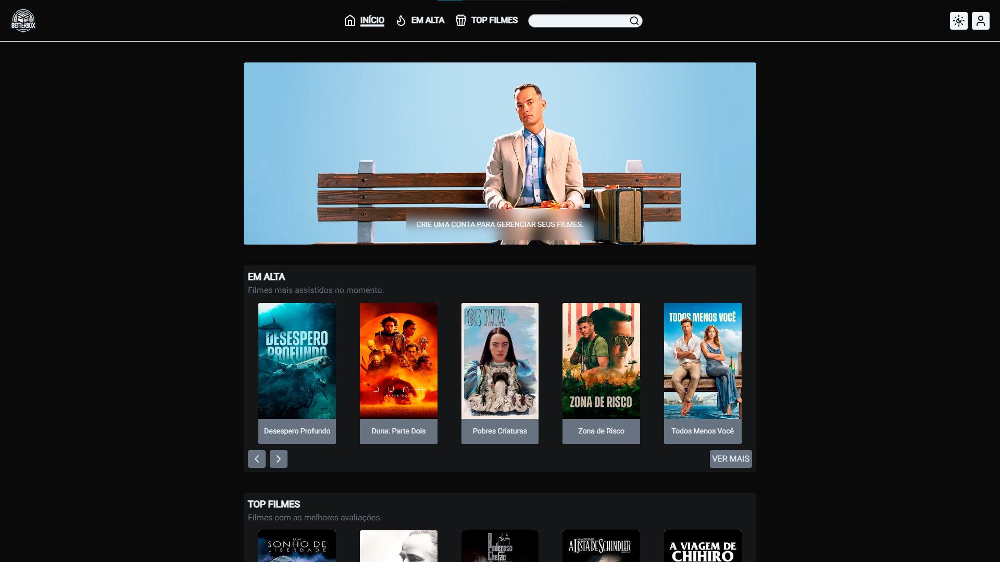

# Betterbox

### [Visitar Projeto](https://betterbox-luiz2k.vercel.app/)
Acesse também o repositório do [Back-end](https://github.com/luiz2k/betterbox-api)

---

## 📝 Sobre
A proposta do projeto é que os usuários gerenciem os filmes que assistiram ou até mesmo seus favoritos podendo assim listar eles. Os usuários também terão a possibilidade possibilidade de adicionar comentários a esses filmes.

### Funcionalidades
- **Registro e Login:** Foi desenvolvido um sistema de registro e login, possibilitando assim os usuários poderem gerenciar seus filmes assistidos e favoritos.
- **Válidação dos Formulários:** Para a válidação dos formulários da aplicação, foi utilizado o **React Hook Form** e o **Zod**. 
- **Fluxo de Autenticação:** Toda a parte do fluxo de autenticação da aplicação foi desenvolvido utilizando o **NextAuth**.

### Tecnologias
- HTML / CSS / TypeScript
- Next.JS
- Tailwind CSS
- Prettier / ESLint
- React Hook Form / Zod
- Zustand
- NextAuth